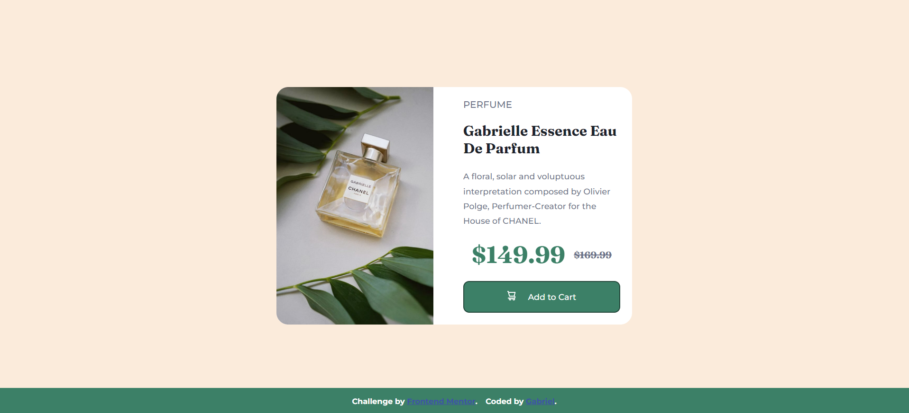

# Frontend Mentor - Product preview card component

## Welcome! 👋

Thanks for checking out this front-end coding challenge.

[Frontend Mentor](https://www.frontendmentor.io) challenges help you improve your coding skills by building realistic projects.

**To do this challenge, you need a basic understanding of HTML and CSS.**

## The challenge

Your challenge is to build out this product preview card component and get it looking as close to the design as possible.

You can use any tools you like to help you complete the challenge. So if you've got something you'd like to practice, feel free to give it a go.

Your users should be able to:

- View the optimal layout depending on their device's screen size
- See hover and focus states for interactive elements

Want some support on the challenge? [Join our Slack community](https://www.frontendmentor.io/slack) and ask questions in the **#help** channel.

### Screenshot

### Links

- Solution URL: [Add solution URL here](https://www.frontendmentor.io/solutions/responsive-product-preview-card-component-using-css-tG5fWGUdre)
- Live Site URL: [Add live site URL here](https://gabrielssconceicao.github.io/product-preview-card-component-main/)

## Author

- Github - [@gabrielssconceicao](https://github.com/gabrielssconceicao)
- Frontend Mentor - [@yourusername](https://www.frontendmentor.io/profile/gabrielssconceicao)

## Built with

- Semantic HTML5 markup
- CSS custom properties
- Flexbox
